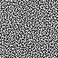

## Naive Blue Noise Generator
- It's really naive

## How to run

```
git clone https://github.com/Ushio/ProgressiveMultiJitteredSampleSequences.git
git submodule update --init
```

## Image


## references 
Iliyan Georgiev, Marcos Fajardo, "Blue-noise Dithered Sampling"